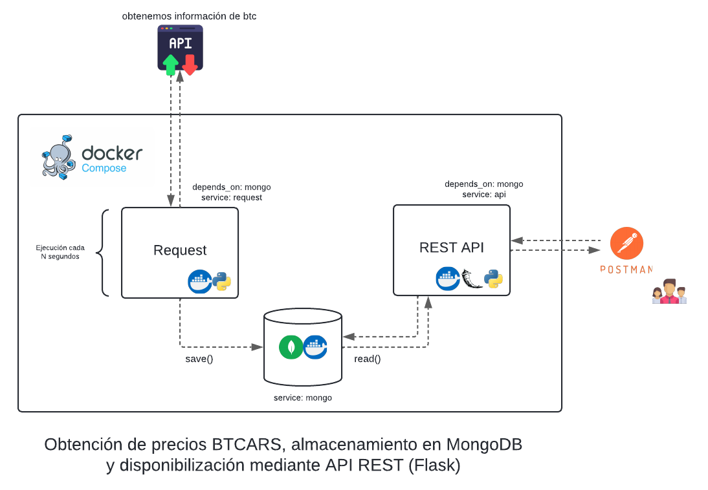

# microservice-exercise-btcars
Creación de microservicio, obteniendo información de API sobre precios de Bitcoin


## Pre - requisitos

Tener instalados Docker & docker-compose. Para mayor información, visite [este enlace](https://docs.docker.com/manuals/).

Tener instalado Git. Puede descargarlo [aquí](https://git-scm.com/downloads)

## Instalación

Descargue el repositorio utilizando el siguiente comando:
```
git clone https://github.com/akak92/microservice-exercise-btcars.git
```

Diríjase al directorio del repositorio utilizando el comando `cd` y cambie el nombre del archivo `.env.example` a `.env`

#### En Windows:
```
mv .env.example .env
```
#### En Linux:
```
ren .env.example .env
```

#### Archivo .env

Aquí se encuentran alojadas las variables de entorno que luego son utilizadas por los distintos servicios.
```
DB_USER=your_db_user
DB_PASSWD=your_db_password
DB_COLLECTION=your_db_collection
URL=https://be.buenbit.com/api/market/tickers/

DEFAULT_PAGE_SIZE=10 # Tamaño utilizado para paginación

SLEEP_TIME_IN_SECONDS=10 #cantidad de segundos para solicitud request.
```
Por defecto, ya existen valores cargados para un correcto funcionamiento del aplicativo.

#### Inicializar los servicios

Ejecute el siguiente comando para inicializar los contenedores:
```
docker-compose up --build --remove-orphans -d
```
El contenedor se inicializará en segundo plano, gracias al argumento `-d`. Recuerde que para ver los logs de los servicios puede utilizar el comando:
```
docker logs <NOMBRE_DEL_CONTENEDOR>
```
## Descripción

El microservicio es subdividido en 3 diferentes servicios (contenedores) que, operando de forma conjunta, ofrecen una solución modular para facilitar su modificación y/o mantenimiento.

* `Servicio request:` Posee un script `main.py` que se ejecuta cada N segundos. Realiza consulta a endpoint de API provista sobre los precios de bitcoin. Establece conexión a base local MongoDB y almacena los valores del elemento "btcars". Se añade campo "timestamp" al documento "btcars" con el timestamp correspondiente a la realización de la consulta `(formato Epoch: número entero, horario local).`

* `Servicio mongo:` Base de datos no relacional que posee una colección llamada `btcars`. Allí almacenamos elementos obtenidos por el servicio request. Es utilizada por el servicio api para consultar la información.

* `Servicio api:` API REST escrita en Flask para la realización de diversas consultas. Utiliza el servicio mongo como fuente de información.

servicio api y request dependen de mongo. Por es su inicialización se fuerza a que sea posterior al inicio del servicio mongo mediante cláusula `depends_on` en el docker-compose.

A continuación se adjunta un diagrama que acompaña lo descrito previamente:


## Utilización

Por terminar...